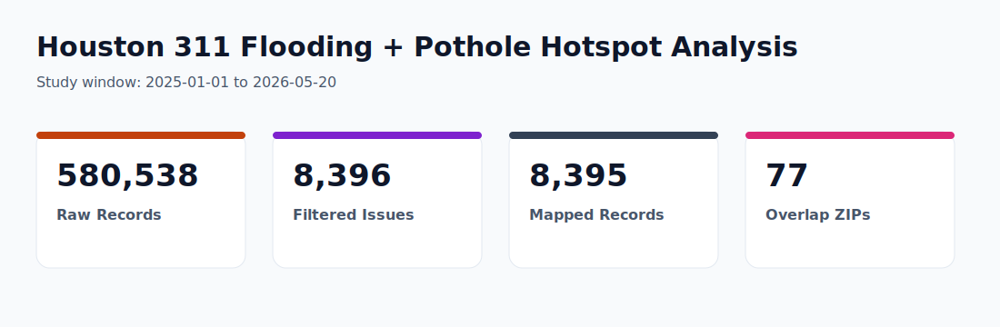
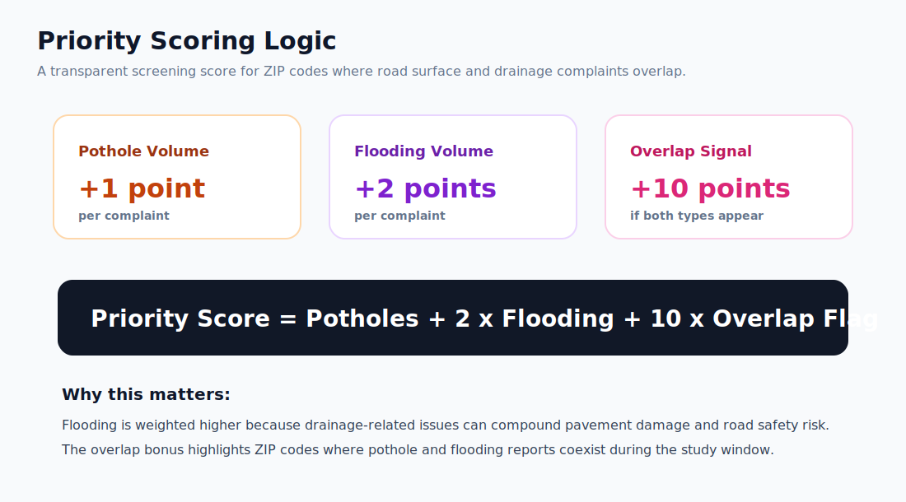
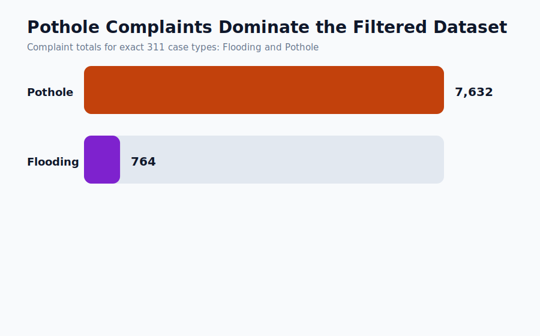
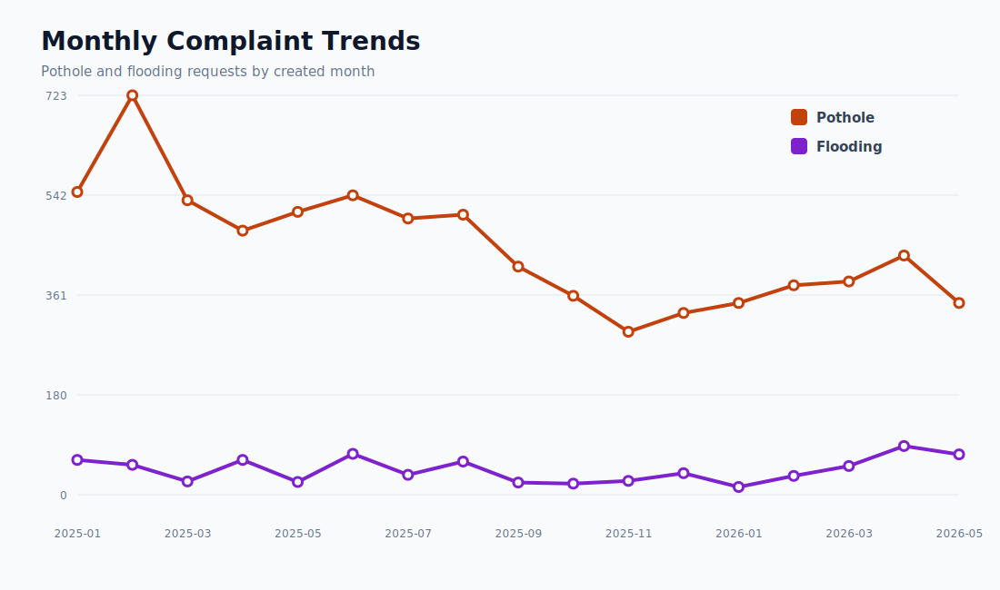
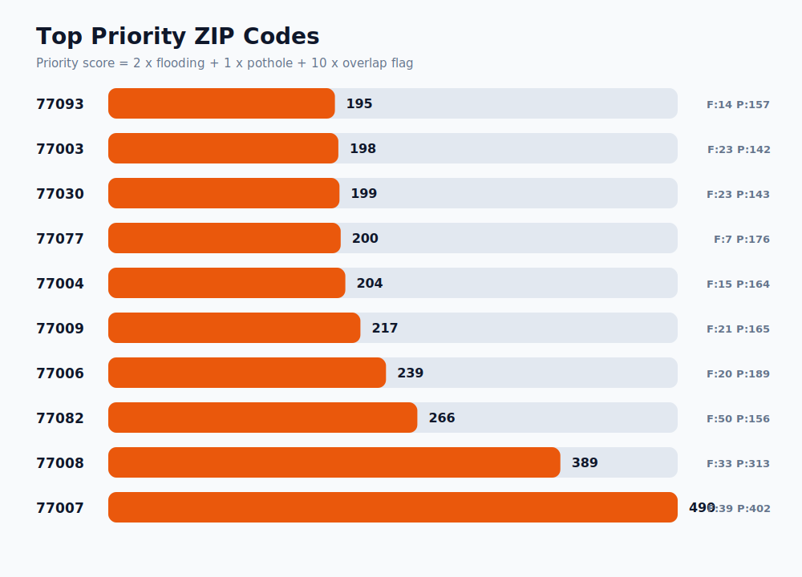
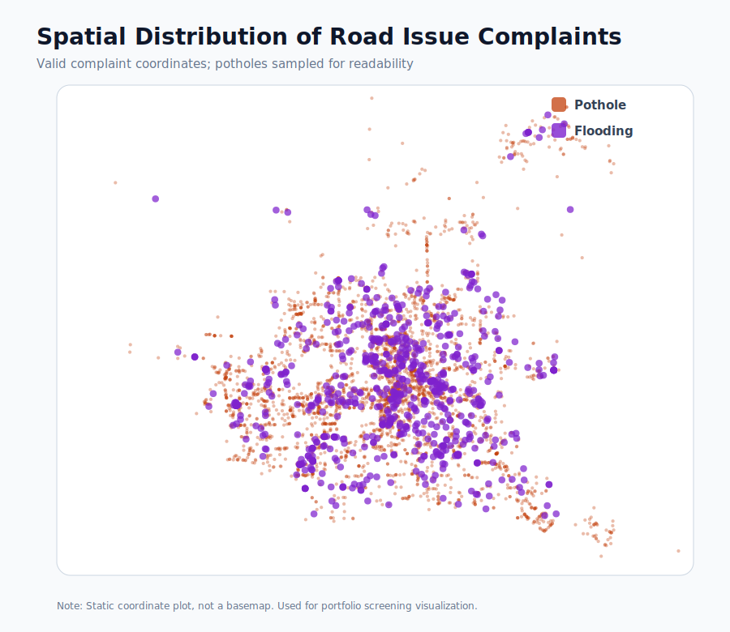

# Houston 311 Road Issue Hotspot Analysis



## Overview

This project uses official City of Houston 311 service request data to identify ZIP-code areas where **flooding** and **pothole** complaints repeatedly occur, then ranks overlap areas with a simple inspection priority score.

The goal is not to claim that 311 data proves where every road defect exists. Instead, this analysis treats resident complaints as a low-cost screening signal that can help prioritize where roadway and drainage teams may want to inspect first.

## Research Question

Which Houston ZIP-code areas show recurring flooding and pothole complaints, and which overlap areas should be prioritized for maintenance inspection?

## Dataset

Source: [City of Houston 311 Service Request Data](https://www.houstontx.gov/311/servicerequestdata.html)

Files used:

- 2025 public 311 service request extract
- 2026 YTD public 311 service request extract

Study window in the rebuilt analysis:

- `2025-01-01` to `2026-05-20`

Raw extracts are not committed because they are large. See [data/README.md](data/README.md) for download instructions.

## Methodology

1. Loaded official 2025 and 2026 YTD Houston 311 piped text extracts.
2. Filtered records to exact case types: `Flooding` and `Pothole`.
3. Standardized created dates, ZIP codes, latitude, and longitude.
4. Removed duplicate case numbers.
5. Flagged valid coordinates for map-based screening.
6. Aggregated complaint counts by month and ZIP code.
7. Ranked ZIP codes using a custom overlap priority score.

## Priority Score



The score intentionally weights flooding higher because drainage-related issues can create compounding roadway risk.

```text
Priority Score = 2 x Flooding Count + Pothole Count + 10 x Overlap Flag
```

Where:

- `Flooding Count` = number of flooding complaints in a ZIP code
- `Pothole Count` = number of pothole complaints in a ZIP code
- `Overlap Flag` = 1 if the ZIP code has both complaint types, otherwise 0

## Key Results

- Raw 311 records loaded: **580,538**
- Filtered flooding/pothole records: **8,396**
- Pothole complaints: **7,632**
- Flooding complaints: **764**
- Valid mapped records: **8,395**
- ZIP codes with both flooding and pothole complaints: **77**
- Peak pothole month: **February 2025** with **723** complaints
- Peak flooding month: **April 2026** with **88** complaints

Top five ZIP codes by priority score:

| ZIP Code | Flooding | Pothole | Total | Priority Score |
|---|---:|---:|---:|---:|
| 77007 | 39 | 402 | 441 | 490 |
| 77008 | 33 | 313 | 346 | 389 |
| 77082 | 50 | 156 | 206 | 266 |
| 77006 | 20 | 189 | 209 | 239 |
| 77009 | 21 | 165 | 186 | 217 |

## Visual Highlights

### Complaint Totals



### Monthly Trends



### Top Priority ZIP Codes



### Spatial Distribution



## Recommendations

- Treat ZIP codes **77007**, **77008**, **77082**, **77006**, and **77009** as priority screening areas because they combine high complaint volume with overlap between flooding and pothole reports.
- Use complaint overlap as a first-pass inspection signal, then validate with field inspection, road segment data, drainage infrastructure records, and maintenance history.
- Re-run the workflow monthly or quarterly as updated 311 extracts become available.

## Limitations

- 311 data reflects reported complaints, not all real-world roadway or drainage defects.
- ZIP-code aggregation is useful for screening but too coarse for final engineering decisions.
- Complaint volume may be affected by population density, resident reporting behavior, and neighborhood awareness of 311.
- The priority score is intentionally simple and should be refined with field, traffic, drainage, and equity data before operational use.

## How To Reproduce

1. Download the 2025 and 2026 YTD piped extracts from the City of Houston 311 data page.
2. Save them in `data/raw/` using these names:

```text
data/raw/houston_311_2025_piped.txt
data/raw/houston_311_2026_ytd_piped.txt
```

3. Install dependencies:

```bash
pip install -r requirements.txt
```

4. Run the analysis:

```bash
python src/analyze_311.py
```

The script regenerates processed CSV files in `data/processed/` and SVG visuals in `figures/`.

## Skills Demonstrated

- Public data analysis
- Data cleaning and filtering
- Exploratory data analysis
- Time-series aggregation
- ZIP-code hotspot ranking
- Geospatial screening with latitude/longitude
- Custom scoring logic
- Visual storytelling for civic analytics

## Project Context

This began as an academic/poster project and was rebuilt into a reproducible analytics portfolio case study.

- Updated poster with rebuilt metrics: [poster/houston_311_updated_poster.svg](poster/houston_311_updated_poster.svg)

